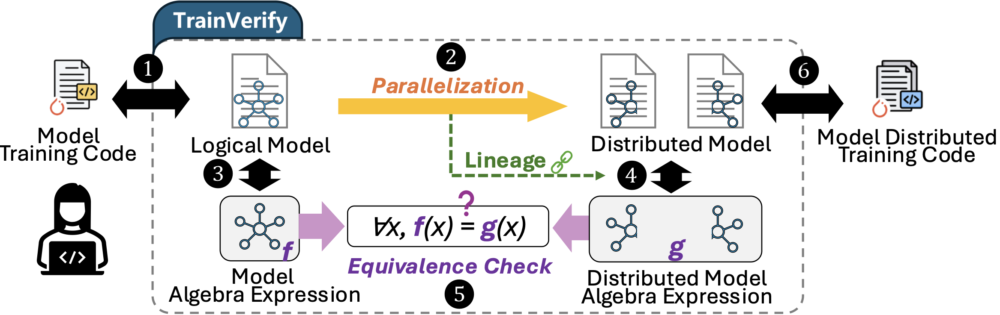
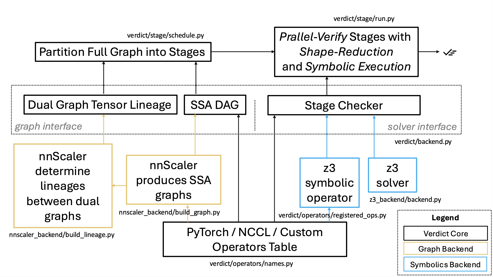

# TrainVerify 

## Introduction
**Overview:** TrainVerify is a verification tool to ensure *parallelization equivalence* in distributed model training. It guarantees that the parallelized model is arithmetically equivalent to its original single-device version, thereby eliminating errors such as incorrect tensor transformations or faulty collective communication introduced during parallelization.

**Workflow:** 
TrainVerify takes the *execution plans* (execplans) of both the original (single-device) and parallelized (multi-device) models, each enriched with *lineages*. It then transforms these into *symbolic SSA DAGs* (single-static assignment directed acyclic graphs). Such dual graphs are partitioned into independent *stages* using lineage information. Each stage undergoes parallel execution, where shape reduction is applied, followed by symbolic verification using Z3. If all stages pass, TrainVerify guarantees end-to-end equivalence.



**Implementation:** 
TrainVerify is implemented with modular interfaces. It defines a general graph interface and a solver interface, supporting a registry of allowable operators. The [*nnScaler*](https://github.com/microsoft/nnscaler) backend constructs SSA DAGs that conform to TrainVerify’s requirements. A high-level view of the implementation is shown below:



## Prepare for your Verification

### 💻 Hardware Requirements
Most GPU machine could run below verification of example MLP model.
To verify large models such as Llama3(405B) and DeepSeek-V3(671B), we recommend to run TrainVerify on a machine with at least 32 CPU (virtual) cores and 1TB memory. 

## Installation
1. Clone the verification branch from nnscaler repo:
   ```
   cd TrainVerify
   git clone https://github.com/microsoft/nnscaler.git -b verification
   ```
2. Create [conda](https://www.anaconda.com/download/success) environment.
    ```
    conda env create -f conda-environment.yml
    conda activate TrainVerify
    ```

3. Run demo verification for an example MLP model `gen_model/model/mlp.py` parallelization.
   
    1) Capture model graphs for verification
        ```
        cd Verdict;
        mkdir gen_model/mgeners;
        bash scripts/gen_mlp_demo.sh
        ```
    2) Perform verification
        ```
        mkdir data/logs;
        bash scripts/demo_mlp.sh 
        ```
        The `scripts/demo_mlp.sh` essentially runs the following command:
        ```
        python main.py \
            --sm gen_model/mgeners/mlp_default_dp1_pp1_tp1_nm1_gbs128_ly2_h0_hi128_sq0.pkl \ 
            --pm gen_model/mgeners/mlp_default_dp2_pp2_tp2_nm2_gbs128_ly2_h0_hi128_sq0.pkl \
            --seed 0 \
            --time \
            --max_ser_proc 30 \
            --max_vrf_proc 30 \
            --loglevel INFO \
            --no_cache_nodes \
            --no_cache_stages \
            |& tee -a data/logs/mlp_default_dp2_pp2_tp2_nm2_gbs128_ly2_h0_hi128_sq0.txt
        ```
        > Command interpretation: `main.py` is the entry of TrainVerify. `--sm` and `--pm` sepcify the paths of single-device model's and parallelized model's execution plan respectively. `--seed` sets z3 random seed. `--time` activates timer. `--max_ser_proc` and `--max_vrf_proc` set the multiprocessing pool size for building SSA DAGs, and parallel stage execution respectively. `--loglevel` sets logger level. `--no_cache_nodes` and `--no_cache_stages` ignore any cached data and run verification from scratch. `|& tee -a ...` writes logs to a file for inspection convenience.
        
        **👀 Expected Output:** The program should print the following message or similar at the bottom of the output. Indicating successful execution of all stages, as well as the verified end-to-end equivalence.
        ```
        PID: ... - ✅ SUCCESS 
        Stats(success=True, ... )
        ```
        > A failed run would print `PID: ... - ❌ FAIL`.
4. Once the demo runs successfully, can proceed to verify your own models. We will continue to provide additional example model verifications in the future.

## Citation

```
@article{lu2025trainverify,
  title={TrainVerify: Equivalence-Based Verification for Distributed LLM Training},
  author={Lu, Yunchi and Miao, Youshan and Tan, Cheng and Huang, Peng and Zhu, Yi and Zhang, Xian and Yang, Fan},  
  booktitle={Proceedings of the ACM SIGOPS 31st Symposium on Operating Systems Principles (SOSP'25)},
  year={2025}
}
```

## Contributing

This project welcomes contributions and suggestions.  Most contributions require you to agree to a
Contributor License Agreement (CLA) declaring that you have the right to, and actually do, grant us
the rights to use your contribution. For details, visit [Contributor License Agreements](https://cla.opensource.microsoft.com).

When you submit a pull request, a CLA bot will automatically determine whether you need to provide
a CLA and decorate the PR appropriately (e.g., status check, comment). Simply follow the instructions
provided by the bot. You will only need to do this once across all repos using our CLA.

This project has adopted the [Microsoft Open Source Code of Conduct](https://opensource.microsoft.com/codeofconduct/).
For more information see the [Code of Conduct FAQ](https://opensource.microsoft.com/codeofconduct/faq/) or
contact [opencode@microsoft.com](mailto:opencode@microsoft.com) with any additional questions or comments.

## Trademarks

This project may contain trademarks or logos for projects, products, or services. Authorized use of Microsoft
trademarks or logos is subject to and must follow
[Microsoft's Trademark & Brand Guidelines](https://www.microsoft.com/legal/intellectualproperty/trademarks/usage/general).
Use of Microsoft trademarks or logos in modified versions of this project must not cause confusion or imply Microsoft sponsorship.
Any use of third-party trademarks or logos are subject to those third-party's policies.
